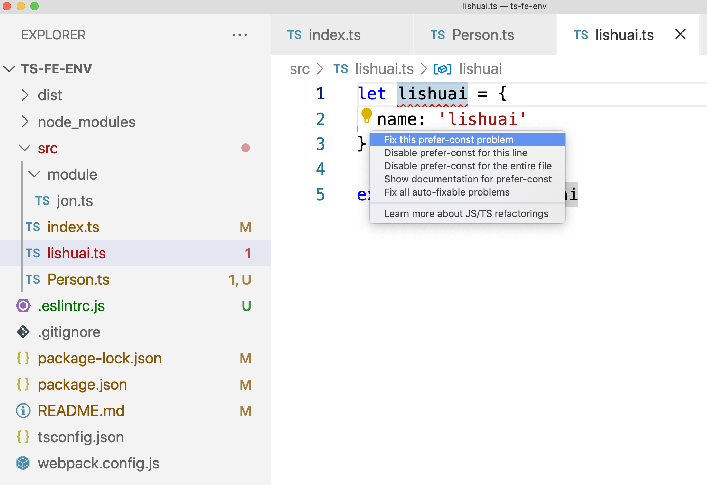

# TypeScript前端开发环境
> 我有一个梦想，一个非常简单的梦想:可以将一群ts文件编译成一个单一的js文件

好吧，在一番探索后，没有能够直接使用tsc来解决这个问题，但是webpack + webpack-loader解决了这个问题。

### 安装依赖：
``` sh
> sudo npm install --save-dev webpack webpack-cli typescript ts-loader
```
- webpack是webpack的核心项目包
- webpack-cli是webpack相关的脚手架
- typescript是ts的编译器
- ts-loader 是webpack集成typescript所需要的加载器

之后配置webpack.config.js，以src/index.js为入口，编译项目，输出到dist/bundle.js文件中，然后通过index.html引用bundle.js就可以了。

### 配置文件
直接复制就行了

### 编译命令：
- `npx webpack` : 直接调用webpack的脚手架来编译
- `npm run watch` : 通过npm script来执行命令
  -- watch 是热编译命令

### 配置文件
- tsconfig.json
  typescript编译选项的配置文件

- webpack.config.js
  webpack编译的配置文件

### 代码检查
现在我还需要代码linter工具。

安装eslint
```sh
$ sudo npm install eslint --save-dev

# 生成配置文件
$ npx eslint --init
# 选择 import/export  typescript等选项
```

安装VSCode插件：https://github.com/fish-js/eslint-setup

在生成的配置文件中，它会自动配置typescript，这样就可以开始代码检查了


